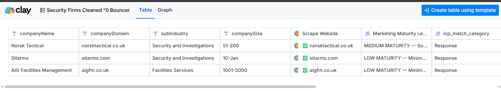
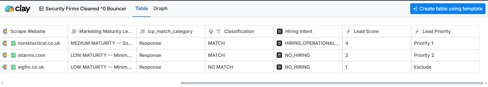

# Clay ICP Qualification Engine

A Clay workflow I built to turn raw company data into qualified and prioritized accounts using company research, ICP validation and business signals. The logic was to find out which companies would qualify for an outbound service.

## Workflow

**Company data → Website research → Marketing maturity → ICP validation → Hiring signal → Lead score → Priority**

## Company research

The workflow starts with company-level data and website research to understand what each business actually does rather than relying only on database classifications.

That research feeds additional qualification around company fit, marketing maturity and business context.

## Qualification & prioritization

Accounts are evaluated across three main factors:

- **ICP Fit** — whether the company genuinely matches the target market
- **Marketing Maturity** — an assessment of the company's existing marketing infrastructure
- **Hiring Intent** — whether current hiring activity provides an additional timing signal

The outputs are combined into a 1–5 Lead Score and converted into a final priority:

**4–5 → Priority 1**  
**2–3 → Priority 2**  
**1 → Exclude**

ICP fit acts as the gatekeeper, so companies that do not match the target market are excluded regardless of other signals.

## Built with

Clay · Website Research · AI Classification · Signal Enrichment · Formula-Based Scoring

## View the workflow

[Open the Clay template](PASTE-YOUR-CLAY-SHARE-LINK-HERE)
